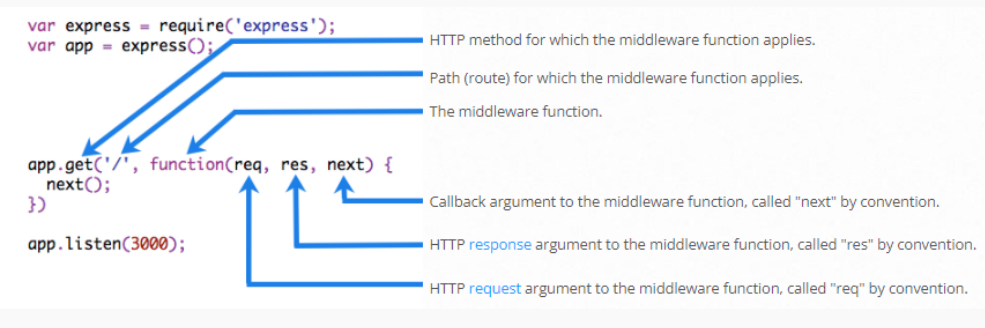

# tugas Writting WEEK 5
## Ervina Nurfa Hidayah || Back-End

# **Web Server & RESTful API**

### **Web Server**

Web server adalah sebuah software (perangkat lunak) yang memberikan layanan berupa data. Berfungsi untuk menerima permintaan HTTP atau HTTPS dari klien atau kita kenal dengan web browser (Chrome, Firefox). Selanjutnya ia akan mengirimkan respon atas permintaan tersebut kepada client dalam bentuk halaman web.

Web server terdiri dari 2 komponen penting:

    - Hardware
         Di sisi perangkat keras (Hardware), server web adalah komputer yang menyimpan perangkat lunak server web dan file komponen situs web. (misalnya, dokumen HTML, gambar, lembar gaya CSS, dan file JavaScript) Server web terhubung ke Internet dan mendukung pertukaran data fisik dengan perangkat lain yang terhubung ke web
    - Software
         Di sisi perangkat lunak (Software), server web mencakup beberapa bagian yang mengontrol bagaimana pengguna web mengakses file yang dihosting. Minimal, ini adalah server HTTP. Server HTTP adalah perangkat lunak yang memahami URL (alamat web) dan HTTP (protokol yang digunakan browser Anda untuk melihat halaman web). Server HTTP dapat diakses melalui nama domain situs web yang disimpannya, dan mengirimkan konten situs web yang dihosting ini ke perangkat pengguna akhir.
        
 Berikut adalah ilustrasi software :
 
 
 Berikut adalah ilustrasi cara kerja Web Server :
 
 Penjelasan dari cara kerja web server :

 - Anda menuliskan nama domain di kolom URL browser Anda. Browser lalu mendapatkan IP address domain tersebut dengan mencarinya di cache atau memintanya ke DNS server.
- Browser kemudian terhubung ke web server dan mengirimkan request file web (yang diminta clients) melalui protokol HTTP.
- Web server menerima request tersebut dan meresponnya dengan mengirimkan file web yang diminta melalui protokol HTTP. Namun jika file tersebut tidak tersedia, web server akan merespon dengan kode error 404. 
- Browser menerima file atau kode error dari web server dan menampilkannya kepada clients.

## Static Web Server VS Dynamic Web Server
1. **Static Web Server**

    Server web statis, atau tumpukan, terdiri dari komputer (perangkat keras) dengan server HTTP (perangkat lunak). Kami menyebutnya "statis" karena server mengirimkan file yang dihosting apa adanya ke browser Anda.

2. **Dynamic Web Server**

    Sebuah server web dinamis terdiri dari server web statis ditambah perangkat lunak tambahan, paling sering server aplikasi dan database. Kami menyebutnya "dinamis" karena server aplikasi memperbarui file yang dihosting sebelum mengirim konten ke browser Anda melalui server HTTP.

## Server Side Programming

Server web menunggu pesan permintaan klien, memprosesnya saat tiba, dan membalas browser web dengan pesan respons HTTP. Respons berisi baris status yang menunjukkan apakah permintaan berhasil atau tidak `(mis. "HTTP/1.1 200 OK" untuk berhasil)`.

Isi respons yang berhasil atas permintaan akan berisi sumber daya yang diminta (misalnya halaman HTML baru, atau gambar, dll...), yang kemudian dapat ditampilkan oleh browser web.

**Server Sites** 

Diagram pada slide berikutnya menunjukkan arsitektur server web dasar untuk situs statis (situs statis adalah situs yang mengembalikan konten hard-coded yang sama dari server setiap kali sumber daya tertentu diminta). Saat pengguna ingin menavigasi ke halaman, browser mengirimkan permintaan `"GET" HTTP` yang menentukan URL-nya.


Berikut adalah arsitektur dari Static Site

**Dynamic sites**

Situs web dinamis adalah situs di mana beberapa konten respons dihasilkan secara dinamis, hanya bila diperlukan. Di situs web dinamis, halaman HTML biasanya dibuat dengan memasukkan data dari database ke dalam placeholder di template HTML (ini adalah cara yang jauh lebih efisien untuk menyimpan konten dalam jumlah besar daripada menggunakan situs web statis).

Situs dinamis dapat mengembalikan data yang berbeda untuk URL berdasarkan informasi yang diberikan oleh pengguna atau preferensi yang disimpan dan dapat melakukan operasi lain sebagai bagian dari pengembalian respons (misalnya, mengirim pemberitahuan).

Sebagian besar kode untuk mendukung situs web dinamis harus dijalankan di server. Membuat kode ini dikenal sebagai "pemrograman sisi server" (atau terkadang "skrip back-end").

Diagram di bawah ini menunjukkan arsitektur sederhana untuk situs web dinamis. Seperti pada diagram sebelumnya, browser mengirim permintaan HTTP ke server, kemudian server memproses permintaan dan mengembalikan respons HTTP yang sesuai.

Permintaan untuk sumber daya statis ditangani dengan cara yang sama seperti untuk situs statis (sumber daya statis adalah file apa pun yang tidak berubah — biasanya: CSS, JavaScript, Gambar, file PDF yang dibuat sebelumnya, dll.).


Permintaan untuk sumber daya dinamis malah diteruskan (2) ke kode sisi server (ditunjukkan dalam diagram sebagai Aplikasi Web). Untuk "permintaan dinamis" server menafsirkan permintaan, membaca informasi yang diperlukan dari database (3), menggabungkan data yang diambil dengan template HTML (4), dan mengirimkan kembali respons yang berisi HTML yang dihasilkan (5,6).

**Perbedaan Static and Dynamic Site**

- Mereka memiliki tujuan dan perhatian yang berbeda.
- Mereka umumnya tidak menggunakan bahasa pemrograman yang sama (pengecualiannya adalah JavaScript, yang dapat digunakan di server- and client-side).
- Mereka berjalan di dalam lingkungan sistem operasi yang berbeda.

**Apa yang dapatd ilakukan pada server-side?**

Pemrograman side-server sangat berguna karena memungkinkan kami menyampaikan informasi secara efisien yang disesuaikan untuk pengguna individu dan dengan menciptakan pengalaman pengguna yang jauh lebih baik.

1. Efficient storage and delivery of information

    Bayangkan berapa banyak produk yang tersedia di Amazon, dan bayangkan berapa banyak posting yang telah ditulis di Facebook? Membuat halaman statis terpisah untuk setiap produk atau posting akan sangat tidak praktis.

    Server tidak terbatas pada pengiriman informasi dari database, dan sebagai alternatif mungkin mengembalikan hasil perangkat lunak, atau data dari layanan komunikasi. Konten bahkan dapat ditargetkan untuk jenis perangkat klien yang menerimanya.

    Karena informasi ada dalam database, informasi tersebut juga dapat lebih mudah dibagikan dan diperbarui dengan sistem bisnis lain (misalnya, ketika produk dijual baik secara online atau di toko, toko mungkin memperbarui database inventarisnya).

2. Customised user experience

    Server dapat menyimpan dan menggunakan informasi tentang klien untuk memberikan pengalaman pengguna yang nyaman dan disesuaikan. Misalnya, banyak situs menyimpan kartu kredit sehingga detailnya tidak perlu dimasukkan lagi. Situs seperti Google Maps dapat menggunakan lokasi tersimpan atau saat ini untuk memberikan informasi perutean, dan penelusuran atau riwayat perjalanan untuk menyoroti bisnis lokal di hasil penelusuran.

    Analisis yang lebih mendalam tentang kebiasaan pengguna dapat digunakan untuk mengantisipasi minat mereka dan lebih lanjut menyesuaikan tanggapan dan pemberitahuan

3. Controlled access to content

    Pemrograman sisi server memungkinkan situs untuk membatasi akses ke pengguna yang berwenang dan hanya menyajikan informasi yang diizinkan untuk dilihat oleh pengguna.

    Jejaring sosial seperti Facebook memungkinkan pengguna untuk sepenuhnya mengontrol data mereka sendiri tetapi hanya mengizinkan teman mereka untuk melihat atau mengomentarinya. Pengguna menentukan siapa yang dapat melihat data mereka, dan dengan ekstensi, data siapa yang muncul di feed mereka — otorisasi adalah bagian utama dari pengalaman pengguna!

4. Store session/state information

    Pemrograman server-side memungkinkan pengembang untuk menggunakan sesi — pada dasarnya, mekanisme yang memungkinkan server untuk menyimpan informasi tentang pengguna situs saat ini dan mengirim respons berbeda berdasarkan informasi itu.

5. Notifications and communication

    Server dapat mengirim pemberitahuan umum atau khusus pengguna melalui situs web itu sendiri atau melalui email, SMS, pesan instan, percakapan video, atau layanan komunikasi lainnya.


    - Facebook dan Twitter mengirim email dan pesan SMS untuk memberi tahu Anda tentang komunikasi baru.
    - Amazon secara teratur mengirimkan email produk yang menyarankan produk serupa dengan yang sudah dibeli atau dilihat yang mungkin menarik bagi Anda.

6. Data analysis

    Sebuah situs web dapat mengumpulkan banyak data tentang pengguna: apa yang mereka cari, apa yang mereka beli, apa yang mereka rekomendasikan, berapa lama mereka berada di setiap halaman. Pemrograman sisi server dapat digunakan untuk memperbaiki respons berdasarkan analisis data ini.

    Amazon dan Google sama-sama mengiklankan produk berdasarkan pencarian sebelumnya (dan pembelian).

### **REST**

**REST**, atau Representational State Transfer, adalah gaya arsitektur untuk menyediakan standar antara sistem komputer di web, sehingga memudahkan sistem untuk berkomunikasi satu sama lain.

Sistem yang sesuai dengan REST, sering disebut sistem RESTful, dicirikan oleh bagaimana mereka tidak memiliki kewarganegaraan dan memisahkan masalah klien dan server

Dalam gaya arsitektur REST, implementasi klien dan implementasi server dapat dilakukan secara independen tanpa saling mengetahui satu sama lain.

Ini berarti bahwa kode di sisi klien dapat diubah setiap saat tanpa mempengaruhi operasi server, dan kode di sisi server dapat diubah tanpa mempengaruhi operasi klien.

Dengan menggunakan antarmuka REST, klien yang berbeda mencapai titik akhir REST yang sama, melakukan tindakan yang sama, dan menerima respons yang sama.

Klien dapat berupa platform web, platform seluler, atau platform desktop.

**Communication between Client and Server**

- Making Requests


    REST mengharuskan klien membuat permintaan ke server untuk mengambil atau mengubah data di server. Permintaan umumnya terdiri dari:

    - kata kerja HTTP, yang mendefinisikan jenis operasi apa yang harus dilakukan
    - header, yang memungkinkan klien untuk menyampaikan informasi tentang permintaan
    - jalan menuju resource
    - messege body yang berisi data

- HTTP VERBS

    Ada 4 kata kerja HTTP dasar yang kami gunakan dalam permintaan untuk berinteraksi dengan sumber daya dalam sistem REST:

    - `GET` — mengambil resource tertentu (berdasarkan id) atau kumpulan sumber daya
    - `POST` — buat resource baru
    - `PUT` — perbarui resource tertentu (berdasarkan id)
    - `DELETE` — menghapus resource tertentu dengan id

**Headers and Accept Parameters**

Di header permintaan, klien mengirimkan jenis konten yang dapat diterimanya dari server.

Ini disebut bidang Terima, dan ini memastikan bahwa server tidak mengirim data yang tidak dapat dipahami atau diproses oleh klien. Opsi untuk tipe konten adalah Tipe MIME (atau Ekstensi Surat Internet Serbaguna, yang dapat Anda baca selengkapnya di Dokumen Web MDN

Tipe lain dan subtipe yang umum digunakan:

    - image — gambar/png, gambar/jpeg, gambar/gif
    - audio — audio/wav, audio/mpeg
    - video — video/mp4, video/ogg
    - aplikasi — aplikasi/json, aplikasi/pdf, aplikasi/xml, aplikasi/octet-stream

**Paths**

REQUEST harus berisi jalur ke sumber daya tempat operasi harus dilakukan. Dalam RESTful API, jalur harus dirancang untuk membantu klien mengetahui apa yang sedang terjadi.

Path seperti `skilvulstore.com/customers/223/orders/12` jelas dalam apa yang ditunjuknya, bahkan jika Anda belum pernah melihat jalur khusus ini sebelumnya, karena jalur ini bersifat hierarkis dan deskriptif.

Kita dapat melihat bahwa kita mengakses pesanan dengan id 12 untuk pelanggan dengan id 223.

**Sending Responses**

- Content Types

    Misalnya, ketika klien mengakses resource dengan id 23 di sumber artikel dengan GET request ini:

    GET /artikel/23 HTTP/1.1
    Accept: teks/html, aplikasi/xhtml

    Server mungkin mengirim kembali konten dengan header respons:

    HTTP/1.1 200 (Oke)
    Tipe-Konten: teks/html.

- Response Codes

    Response dari server berisi kode status untuk memperingatkan klien tentang informasi tentang keberhasilan operasi. Sebagai pengembang, Anda tidak perlu mengetahui setiap kode status (ada banyak kode status), tetapi Anda harus mengetahui kode yang paling umum dan cara penggunaannya.

    

    Untuk setiap HTTP Verb, ada kode status yang diharapkan yang harus dikembalikan server setelah berhasil::

    - `GET` — return 200 (OK)
    - `POST` — return 201 (CREATED)
    - `PUT` — return 200 (OK)
    - `DELETE` — return 204 (NO CONTENT) If the operation fails, return the most specific status code possible corresponding to the problem that was encountered.

# **Intro & Essential Node JS**

## Pengertian

**Node.js** adalah  `open-source`, `cross-platform`, `back-end JavaScript runtime environment` yang berjalan pada V8 mengeksekusi kode JavaScript di luar browser web. Node.js memungkinkan pengembang menggunakan JavaScript untuk menulis alat baris perintah dan untuk skrip server- side menjalankan skrip server-side untuk menghasilkan konten halaman web dinamis sebelum halaman dikirim ke browser web pengguna.


node.js arsitektur

Seperti pada gambar berikut, Node JS memiliki konsep yang berbeda dengan javascript. 

Contoh Node.Js dalah web server :
```h
var http = require(‘http’);

var server = http.createServer(function (req, res){res.end (“Halo, selamat datang di situs resmi Nodejs “);}); server.listen (8000);

console.log (“server running on http://localhost:8000”);
```

### Node JS Architecture

- Single Thread

    Thread dalam ilmu komputer adalah eksekusi menjalankan beberapa tugas atau program secara bersamaan. Setiap unit yang mampu mengeksekusi kode disebut thread.

    Javascript menggunakan konsep single thread, yang berarti hanya memiliki satu tumpukan panggilan yang digunakan untuk menjalankan program.

    

    Javascript menggunakan call stack untuk melakukan manajemen single thread. Ketika terdapat perintah baru maka akan ditambahkan (push) dan akan di keluarkan ketika perintahnya sudah selasai (pop)

- Even Loop

    Dengan menggunakan konsep arsitektur javascript, walaupun menggunakan single thread tetapi kita dapat melihat javascript seperti menggunakan multi thread

    Terdapat event queue yang berguna sebagai penampung ketika terdapat perintah baru yang akan dieksekusi.

    Event loop akan memfasilitasi kondisi ini, event loop akan memeriksa terus menerus, ketika antrian kosong di call stack maka akan menambah antrian baru dari event queue sampai semua perintah selesai di eksekusi.

    Contoh :
    ```h
    import {EventEmitter} from 'events';

    async function publishEvent(workerId: string, iterationNumber: number) {
    console.log(`[${new Date().toLocaleString()}][${workerId}] Mengirim pesan [${iterationNumber}] ke PubSub`);
    }

    function start(workerId: string) {
    let iterationNumber = 0;
    setInterval(async () => {
        iterationNumber++;
        console.log(`[${new Date().toLocaleString()}][${workerId}] Iterasi ${iterationNumber}`);
        await publishEvent(workerId, iterationNumber);
        }, 1000);
    }

    async function main() {
    const emitter = new EventEmitter();
    emitter.on('start', async workerId => {
        start(workerId);
    });
    emitter.emit('start', 'worker1');
    emitter.emit('start', 'worker2');

    }

    main().then(() => 'Mulai').catch(err => console.error(err));

    setInterval(() => console.log(`[${new Date().toLocaleString()}] Tick!`), 1000);
    ```

    Hasilnya pada saat dijalankan akan terlihat seperti berikut ini:

    ```h
    [00:26:45][worker1] Iterasi 1
    [00:26:45][worker1] Mengirim pesan [1] ke PubSub
    [00:26:45][worker2] Iterasi 1
    [00:26:45][worker2] Mengirim pesan [1] ke PubSub
    [00:26:45] Tick!
    [00:26:46][worker1] Iterasi 2
    [00:26:46][worker1] Mengirim pesan [2] ke PubSub
    [00:26:46][worker2] Iterasi 2
    [00:26:46][worker2] Mengirim pesan [2] ke PubSub
    [00:26:46] Tick!
    [00:26:47][worker1] Iterasi 3
    [00:26:47][worker1] Mengirim pesan [3] ke PubSub
    [00:26:47][worker2] Iterasi 3
    [00:26:47][worker2] Mengirim pesan [3] ke PubSub
    [00:26:47] Tick!
    ```

- Server Side Scripting

    Sejatinya javascript merupakan bahasa pemrograman yang digunakan di front end side. Sehingga kita hanya bisa mengerjakan javascript dengan menggunakan browser untuk menampilkan hasil eksekusinya. 
    Tetapi dengan menggunakan NodeJS kita dapat menjalankan javascript di server side menggunakan terminal command line menggunakan perintah   `node`. 

    ```h
    > console.log("hello world");
    hello world
    ```

### Javascript For Node JS

Sebelum masuk lebih dalam ke Node JS, terdapat beberapa materi yang perlu direview dan di pahami lagi dari bahasa pemorgraman javascript agar mempermudah memahami Node JS  yaitu :

- Arrow function expression
- Asynchronous
- JSON

**Arrow Expression**

Arrow expression merupakan fitur terbaru dari javascript, yaitu mempermudah membuat sintaks function menggunakan `=>`.

Contoh :
```h
// ES5 syntax
var multiply = function(x, y) {
  return x * y;
};
// ES6 arrow function
var multiply = (x, y) => { return x * y; };
// Or even simpler
var multiply = (x, y) => x * y;
```

**Asynchronous**

**Asynchronous** merupakan konsep yang paling penting dari javascript. Pada dasarnya, javascript mengeksekusi code secara single thread dan berurutan baris per baris yang disebut dengan synchronous. Sedangkan asynchronous memungkinkan mengeksekusi code tanpa berurutan dengan cara “skip” code dan melanjutkan eksekusi code selanjutnya. Konsep ini menungkinkan code kita tidak terjadi blocking dan lebih efisien.
```h
console.log("1");

setTimeout(()=> {
    console.log("2");
} , 3000)

console.log("3");
```

**JSON**

**JSON** atau Javascript Object Notation merupakan format yang digunakan untuk menyimpan dan mengirim data menggunakan konsep object di javascript. JSON dapat digunakan di hampir semua bahasa pemrograman sehingga sangat cocok untuk dipelajari.

Contoh :
```h
{"users": [
  {"username" : "Uwi", "lokasi" : "Bandung"},
  {"username" : "Inod", "lokasi" : "Purwakarta"},
  {"username" : "Diva", "lokasi" : "BuahBatu"},
  {"username" : "Piong", "lokasi" : "Banjaran"}
] }
```

### Build In Module Node JS

- **Console** merupakan module bawaan dari javascript yang ada di node JS untuk digunakan sebagai debug atau menampilkan code secara interface.

- **Process** adalah modules yang digunakan untuk menampilkan dan mengontrol prosess Node JS yang sedang dijalankan.

- **OS module** merupakan module yang digunakan untuk menyediakan informasi terkait sistem operasi komputer yang digunakan user.

- **Util Module** merupakan alat bantu / utilities untuk mendukung kebutuhan internal API di Node JS.

- **Event**

    

- **Errors** merupakan modules yang dapat digunakan untuk mendefinisikan error di Node JS sehingga lebih informatif. Kita juga dapat menghandle error menggunakan try catch.

- **Buffer** merupakan modules yang digunakan untuk mengakses, mengelola dan mengubah tipe data raw atau tipe data bytes.

- **Fs atau “file system”** merupakan module yang dapat membantu berinteraksi dengan file yang ada diluar code. FS paling sering digunakan untuk membaca file dengan ekstensi .txt, .csv, dan .json.

- **Timers** merupakan modules yang digunakan untuk melakukan scheduling atau mengatur waktu pemanggilan fungsi yang dapat diatur di waktu tertentu

### Membuat Web Server Dengan Node JS

**Node JS Web Server**

Node.js memiliki built-in modul yang disebut HTTP, built-in modul ini memungkinkan Node JS mentransfer data melalui Hyper Text Transfer Protocol (HTTP).

Modul HTTP dapat membuat server HTTP yang mendengarkan port server dan memberikan respons kembali ke klien.

- Untuk menggunakan modul HTTP, gunakan require()

- Gunakan method createServer() untuk membuat server HTTP

- Callback function yang digunakan pada method `http.createServer()`, akan dijalankan ketika seseorang mencoba mengakses komputer pada port 8080.

Contoh :
```h
var http = require('http');

//create a server object:
http.createServer(function (req, res) {
  res.write('Hello World!'); //write a response to the client
  res.end(); //end the response
}).listen(8080); //the server object listens on port 8080
```

**Menambahkan HTTP Header**

- Kita bisa menggunakan method res.writeHead() untuk menambahkan header HTTP.

- Argumen pertama dari method res.writeHead() adalah status code, 200 berarti semuanya OK

- Argumen kedua adalah objek yang berisi header respons.

- Contoh : 
Jika respons dari server HTTP seharusnya ditampilkan sebagai HTML, maka kita harus menambahkan header HTTP dengan tipe konten yang benar

Contoh :
```h
var http = require('http');
http.createServer(function (req, res) {
  res.writeHead(200, {'Content-Type': 'text/html'});
  res.write('Hello World!');
  res.end();
}).listen(8080);
```

- Respons yang dikembalikan dari HTTP web server bisa dalam berbagai format.

- Contohnya, Kita bisa mengembalikan response dalam format JSON dan HTML, namun kita juga dapat mengembalikan format teks lain seperti XML dan CSV.

- Selain itu web server dapat mengembalikan data non-teks seperti PDF, file zip, audio, dan video.

- Format ini harus ditambahkan kedalam HTTP Header.

**Membaca Query String**

- Callback function pada method `http.createServer()` memiliki argumen req yang mewakili request dari klien, sebagai objek (objek http.IncomingMessage).

- Objek ini memiliki sebuah properti yang disebut "url" yang menyimpan informasi url yang sedang mengakses.

    Contoh :
    ```h
    var http = require('http');
    http.createServer(function (req, res) {
    res.writeHead(200, {'Content-Type': 'text/html'});
    res.write(req.url);
    res.end();
    }).listen(8080);
    ```

- Ketika server di jalankan, kemudian kita akses dari browser ke url : http://localhost:8080/skilvul
maka akan tampil tulisan skilvul.

- Ketika server di jalankan, kemudian kita akses dari browser ke url : http://localhost:8080/javascript
maka akan tampil tulisan javascript.

**Split Query String**

- Ada build-in module yang bisa kita gunakan untuk split query string menjadi beberapa bagian yang dapat dibaca.

- Build-in modulenya adalah URL Module.

Contoh :
```h
var http = require('http');
var url = require('url');

http.createServer(function (req, res) {
  res.writeHead(200, {'Content-Type': 'text/html'});
  var q = url.parse(req.url, true).query;
  var txt = q.year + " " + q.month;
  res.end(txt);
}).listen(8080);
```

# **Express JS**

## Pengertian

Express.js, atau hanya Express adalah `back end web application framework` for `Node.js`, dirilis sebagai perangkat lunak sumber terbuka dan gratis di bawah Lisensi MIT. Ini dirancang untuk membangun aplikasi web dan API. Ini telah disebut sebagai kerangka kerja server standar de facto untuk Node.js.

### **Back End Web Application**
Back end app adalah aplikasi yang berjalan di server-side yang bekerja untuk memberikan informasi berupa data sesuai request dari client / browser / front end app. Umumnya server-side app membuat REST API.


Kelebihan dari framework ini terletak pada fitur caching, support dengan Google V8 Engine, JavaScript, serta didukung oleh komunitas dan skalabilitas aplikasi yang baik.

### **REST API**

**RESTful API / REST API** merupakan penerapan dari API (Application Programming Interface). 

Sedangkan **REST (Representional State Transfer)** adalah sebuah arsitektur metode komunikasi yang menggunakan protokol HTTP untuk pertukaran data dimana metode ini sering diterapkan dalam pengembangan aplikasi. Dengan tujuannya untuk menjadikan sistem memiliki performa yang baik, cepat dan mudah untuk di kembangkan (scale) terutama dalam pertukaran dan komunikasi data.

4 Komponen RESTFUL API :
- URL Design
- HTTP Verbs
- HTTP Response Code
- Format Response

**Basic Syntax expressJS**

```h
const express = require('express')
const app = express()
const port = 3000

app.get('/', (req, res) => {
  res.send('Hello World!')
})

app.listen(port, () => {
  console.log(`Example app listening on port ${port}`)
})
```

Contoh diatas adalah basic syntax dari express JS. Kita akan menggunakan module express kemudian yang berisi routing dan listen.

## Basic Routes

1. Routes

    Kita bisa menjalankan aplikasi sederhana kita dengan cara menggunakan “node”. Dan aplikasi kita akan berjalan di alamat ‘http://localhost:3000’

    Kemudian kita dapat mengaksesnya di website dan menambah route yang akan kita akses yaitu `/`

2. Method

    Kita dapat menggunakan method yang dalam REST API seperti `POST`, `PUT`, `PATCH` dan `DELETE`.

3. Response

    Di dalam route kita dapat mengirim response menggunakan parameter dari route express.js yaitu `res.Send()` untuk mengirim plain text ketika kita mengakses route tersebut. Terdapat banyak response yang bisa kita buat selain yang dicontohkan.

    ```h
    app.get('/user/:id', (request, response) => {
    response.send(`user ${request.params.id}`)
    })
    ```

    Kita dapat mengirim response berupa output json yang biasa dipakai untuk back end application. Dengan menggunakan output json maka kita dapat mengirim data yang mudah diakses.

4. Status Code
    
    ```h
    const express = require('express');
    const app = express();
    const products = ["Milk", "Sugar"];
    
    app.get('/', (req, res) => {
        res.send('Hello Geeks!');
    });
    
    app.get('/products', (req, res) => {
        if (products.length === 0) {
            res.status(400);
            res.send('No products found!');
        } else {
            res.json(products);
        }
    });
    app.listen(3000);
    ```

    Dalam pengaplikasian back end application, kita sangat perlu memberikan status code sebagai informasi apakah route yang kita akses berjalan sebagaimana mestinya dan tidak terjadi error.

5. Query

    Query merupakan parameter yang digunakan untuk membantu menentukan tindakan yang lebih spesifik daripada hanya sekedar router biasa. Biasanya query ditaruh di akhir route dengan memberikan informasi diawali dengan “?” kemudian tedapat key dan data yang dapat ditindak lanjuti. Ex : `?q=hello&age=23` 

    Bagi yang sadar, ketika kita search di google maka terdapat query di route yang kita akses.
    
    

6. Nested Route

    Nested route digunakan ketika terdapat banyak route yang memiliki nama yang sama atau ingin membuat route yang lebih mendalam

## Express Middleware

 Middleware adalah fungsi yang digunakan untuk mengakses permintaan object (req), respons object (res), dan setiap siklus permintaan dan respon tersebut (next).

 Pada Express.js, cara kerja Middleware adalah dengan mengeksekusi setiap skrip, membuat perubahan terhadap permintaan dan respons object, mengakhiri siklus permintaan-respons, lalu menyiapkan Middleware untuk siklus berikutnya.



### Cara Kerja Middleware

- Dari ilustrasi diatas, kita bisa menganalogikan bahwa buah lemon yang di bawa sendiri oleh pelanggan adalah sebuah HTTP request, dan stan minuman lemon adalah sebuah server.

- Anda akan memeriksa asal buah lemon yang di bawa langsung oleh pelanggan, sama seperti yang Anda lakukan dengan sebuah HTTP request, sebelum menerima atau menolak sebuah HTTP request.

- Tidak semua HTTP Request itu bagus dan benar, jadi server masih perlu melakukan filtering request.

- Karyawan Anda - Larry, Curly, dan Moe – bisa di ibaratkan seperti middleware function untuk stan  minuman lemon Anda.

- Jika pada tahap mana pun middleware function menentukan bahwa suatu HTTP Request adalah request yang buruk dan salah, maka middleware function memiliki kemampuan untuk menghentikan request-response cycle.

- Berlaku juga sebaliknya, jika middleware function menentukan suatu HTTP Request baik dan benar, maka middleware function memiliki kemampuan untuk melanjutkan request-response cycle ke proses selanjutnya.

- Setelah sebuah HTTP Request melewati semua middleware yang ada di aplikasi, HTTP Request tersebut akan mencapai handler function — yang, dalam kasus contoh ilustrasi ini, adalah Anda yang menjual minuman lemon (atau, lebih khusus lagi, proses membuat minuman lemon).

- Setelah sebuah HTTP Request melewati semua middleware yang ada di aplikasi Anda, HTTP Request tersebut akan mencapai handler function — yang, dalam kasus contoh ilustrasi ini, adalah Anda yang menjual minuman lemon (atau, lebih khusus lagi, proses membuat minuman lemon).

- Ini hanya contoh sederhana. Dalam skenario nyata, Kita mungkin perlu menggunakan beberapa middlewares untuk melakukan satu tugas, seperti melakukan pencatatan setiap HTTP Request ataupun melakukan validasi inputan user.

### Yang Bisa Dilakukan Oleh Function Middleware

Sebuah middleware function dapat melakukan tugas-tugas berikut:

- Menjalankan kode apapun.

- Memodifikasi Object Request dan Object Response.

- Menghentikan request-response cycle.

- Melanjutkan ke middleware function selanjutnya atau ke handler function dalam suatu request response cycle.

### Kemampuan Fungsi Middleware : Menjalankan Kode Apapun

- Sebuah function middleware bisa digunakan untuk mengeksekusi kode apapun untuk suatu tujuan tertentu.

- Sebagai contoh, kita akan membuat sebuah middleware function yang akan mencetak tulisan “Halo Skilvul, request diterima!” Ketika sebuah HTTP Request masuk kedalam middleware function ini. 

- Middleware Function ini akan diberi nama dengan skilvulLogger.

#### Kemampuan Fungsi Middleware : Memodifikasi Object Request dan Object Response.

- Sebuah function middleware bisa digunakan untuk memodifikasi Object Request dan Object Response.

- Sebagai contoh, kita akan membuat sebuah middleware function yang akan menambahkan informasi request time pada object request.

- Middleware Function ini akan diberi nama dengan addRequestTime.

#### Kemampuan Fungsi Middleware : Menghentikan Request-Response Cycle.

- Sebuah function middleware bisa digunakan untuk menghentikan request-response cycle.

- Sebagai contoh, kita akan membuat sebuah middleware function yang akan menghentikan request-response cycle.

- Middleware Function ini akan diberi nama dengan stopHere.

- Request tidak akan pernah sampai ke handler function, karena middleware
telah menghentikan request-response cycle dengan res.send() dan tidak memanggil next()

#### Kemampuan Fungsi Middleware : Melanjutkan Ke Middleware Function Selanjutnya / Ke Handler Function.

- Sebuah function middleware bisa digunakan untuk melanjutkan ke middleware function selanjutnya / ke handler function.

- Sebenarnya kita sudah melakukannya pada contoh-contoh sebelumnya, yaitu dengan cara memanggil function next() pada sebuah middleware function.

- Jika sebuah middleware function tidak mengakhiri request-response cycle, maka middleware tersebut harus memanggil function next() untuk melanjutkan request ke middleware function selanjutnya / ke handler function.

- Apabila hal tersebut tidak dilakukan (memanggil function next()), maka request akan tetap dalam kondisi menggantung (tidak mengembalikan response) sampai terjadinya error timeout.

### Jenis Express Middleware Berdasarkan Cara Penggunaan

Express Middleware dapat dikelompokkan berdasarkan dari dimana middleware function itu digunakan :

1. Application Level Middleware
2. Router Level Middleware
3. Error Handling Middleware

#### Jenis Express Middleware Berdasarkan Cara Penggunaan : Application Level Middleware

- Application Level Middleware adalah sebuh function middleware yang melekat ke instance object Application Express.

- Penggunaannya dengan cara memanggil method app.use().

- Application Level Middleware akan di jalankan setiap kali Express Application menerima sebuah HTTP Request.

#### Jenis Express Middleware Berdasarkan Cara Penggunaan : Router Level Middleware

- Router Level Middleware adalah sebuh function middleware yang cara kerjanya sama persis dengan application level middleware, yang menjadikan perbedaan adalah middleware function ini melekat ke instance object Router Express.

- Penggunaannya dengan cara memanggil method express.Router().

- Router Level Middleware hanya akan di jalankan setiap kali sebuah Express Router yang menggunakan middleware ini menerima sebuah HTTP Request, sedangan pada Router yang lain tidak akan dijalankan.

#### Jenis Express Middleware Berdasarkan Cara Penggunaan : Error Handling Middleware

Sebuah error handling middleware function harus memberikan 4 (empat) buah argument (err, req, res, next) agar bisa di deteksi oleh Express Application sebagai error handling middleware, sekalipun kita tidak akan pernah menggunakan function next dalam error handling middleware ini.

Jika hal ini tidak dilakukan, maka Express Application tidak akan mengenali middleware function ini sebagai error handling middleware, dan akan memperlakukan middleware ini sebagai Application Level Middleware seperti biasa.

#### Jenis Express Middleware Berdasarkan Source Middleware Function

Express Middleware dapat juga dikelompokkan berdasarkan dari dimana middleware function itu didapatkan :

1. Express Build-in Middleware
2. Third Party (custom) Middleware

####  Jenis Express Middleware Berdasarkan Source Middleware Function : Express Build-in Middleware

<br>
Express JS sudah menyediakan 3 buah build-in middleware function yang bisa digunakan :

1. express.static() : Middleware function ini memungkinkan sebuah express application melayani asset statis berupa file, seperti file HTML, gambar, video, dokumen, dan sebagainya.
2. express.json() : Middleware function ini memungkinkan sebuah express application menerima HTTP Request yang membawa payload (data) dalam format JSON.
3. express.urlEncoded() : Middleware function ini memungkinkan sebuah express application menerima
HTTP Request yang membawa payload (data) dalam format urlencoded.
<br>

#### Jenis Express Middleware Berdasarkan Source Middleware Function : Express Third Party (custom) Middleware
<br>
Membuat custom middleware function atau menggunakan third party middleware function dapat menambahkan fungsionalitas dari sebuah Express Application.

Selain membuat sendiri middleware function custom, kita bisa juga menggunakan third party middleware (middleware function yang di buat oleh orang lain).

Ada beberapa Third Party middleware yang di Kelola oleh Express JS team, ada juga yang di Kelola secara community.

Berikut adalah contoh third party middleware yang dikelola oleh Express JS Team :
1. cors
2. body-parser
3. errorhandler
4. morgan
5. Multer

Berikut adalah contoh third party middleware yang dikelola oleh community:
1. helmet
2. passport
3. express-validator
4. swager-ui-express

# **Design Database With MySQL**

**Desain basis data** adalah serangkaian kegiatan yang bertujuan untuk meningkatkan pengembangan, implementasi, dan pemeliharaan sistem manajemen data perusahaan. Tujuan utamanya adalah untuk mencerminkan garis besar sistem database ke dalam model nyata: fisik dan logis. Perancang basis data menentukan data apa yang akan disimpan di dalam basis data, dan bagaimana objek terkait satu sama lain.

Tahapan : 

1. Conceptual Design, pada tahapan ini desain yang dibuat masih berbentuk konsep secara keseluruhan dan umum. Tahap ini fokus pada model data yang akan digunakan tanpa memikirkan logika-logika penyimpanan database dan pertimbangan fisik database tersebut. Output dari tahapan ini biasanya first cut ERD (Entity Relationship Diagram.

2. Menerjemankah Conceptual Design menjadi Logical Design. Akan ada proses validasi model data yang ada, apakah sesuai dengan logika-logika database dan sudah sesuai secara sturktural. Pada tahapan ini juga bisa dilakukan normaliasi untuk melihat kesesuaian model data yang dalam mendukung transaksi yang ada. Beberapa konsep logika database yang digunakan dalam tahapan ini adalah:

    - Strong Entitiy Types
    - Weak Entitiy Types
    - One-to-many (1:*) Binary Relationships Types
    - One-to-one (1:1) Binary Relationships Types
    - One-to-one (1:1) Recursive Relationships
    - Superclass/ Subclass Relationships Types
    - Many-to-many (*:*) Binary Relationships Types
    - Complex Relationships Types
    - Multi-valued Attributes

3. Database desain adalah Physical Design. Tahap ini lebih fokus pada structural database secara detail. Penyimpanan data dan hubungan pada database akan dibuat pada tahap ini. Bukan hanya structural dan hubungan data, tapi juga memperhatikan integritas data yang akan disimpan di database tersebut. Secara langsung desain yang sudah ada akan dibuat atau bisa disebut mengkonstruksi database.

    
